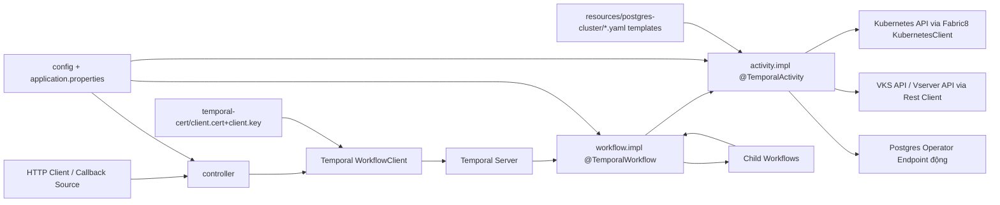
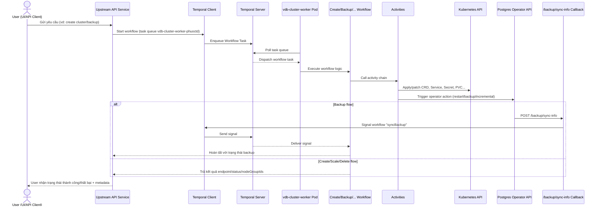
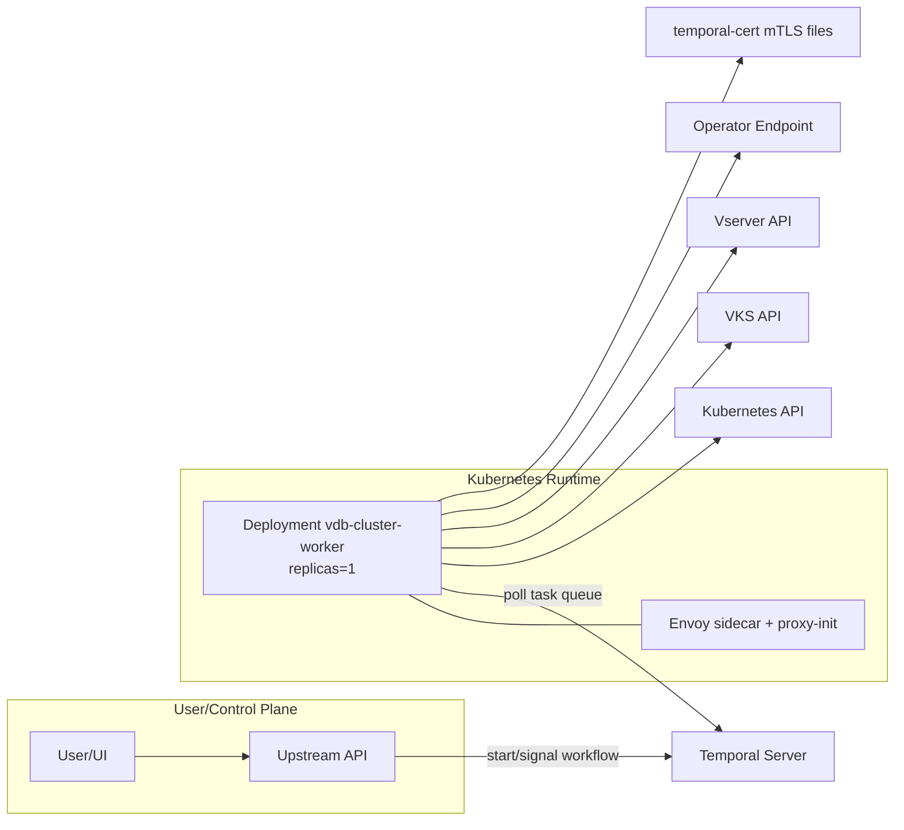

# Báo cáo kiến trúc hệ thống `vdb-cluster-worker` (Quarkus + Temporal + Kubernetes)

Phạm vi phân tích:

- Tập trung `src/main` và các file cấu hình ở root.
- Bỏ qua hoàn toàn `test` và `native-test`.

---

## Bước 1: Khám phá cấu trúc thư mục và tổ chức code

### 1.1 Thư mục gốc và file quan trọng

Các thành phần đáng chú ý ở root:

- `pom.xml`: định nghĩa dependency và build Maven (Quarkus 3.14.4, Java 21).
- `Dockerfile`, `jvm.Dockerfile`, `native.Dockerfile`: build image chạy worker.
- `vdb-cluster-worker.yaml`: cấu hình CI/CD + runtime deploy (replica/resources/probe/envoy sidecar...).
- `mvnw`, `mvnw.cmd`: wrapper Maven.
- `temporal-cert/`: chứa `ca.cert`, `client.cert`, `client.key` cho mTLS Temporal.
- `src/`: mã nguồn chính.

### 1.2 Cấu trúc `src/main/java`

Namespace chính: `com.engineering`.


| Thư mục / Package                                                    | Chức năng chính                                     | Ghi chú                                                                                  |
| -------------------------------------------------------------------- | --------------------------------------------------- | ---------------------------------------------------------------------------------------- |
| `com.engineering.controller`                                         | REST Resource nhận HTTP vào                         | Có `BackupController` (prod callback) và `TestController` (test/manual trigger workflow) |
| `com.engineering.temporal.workflow`                                  | Temporal workflow interfaces (`@WorkflowInterface`) | 17 workflow interface                                                                    |
| `com.engineering.temporal.workflow.impl`                             | Workflow implementation (`@TemporalWorkflow`)       | Tất cả gắn worker name `vdb-cluster-worker`                                              |
| `com.engineering.temporal.activity`                                  | Temporal activity interfaces (`@ActivityInterface`) | 4 nhóm activity: Common, NodeGroup, PostgresOperator, PostgresCluster                    |
| `com.engineering.temporal.activity.impl`                             | Activity implementation (`@TemporalActivity`)       | Thực thi thao tác K8s, gọi API ngoài, retry/poll điều kiện                               |
| `com.engineering.temporal.request` + `response`                      | DTO cho workflow/activity                           | Tập trung domain Postgres cluster                                                        |
| `com.engineering.temporal.utils`                                     | Cấu hình retry/options/task queue                   | `TemporalUtils` chứa retry policy, queue, namespace                                      |
| `com.engineering.config`                                             | Bean cấu hình app/k8s/management                    | Dùng `@ConfigProperty`, không dùng `@ConfigMapping`                                      |
| `com.engineering.rest_client.service`                                | MicroProfile REST Client gọi dịch vụ ngoài          | `VksApiService`, `VserverApiService`, `OperatorApiService`                               |
| `com.engineering.rest_client.resolver`                               | Resolve endpoint động + tạo client                  | Chọn endpoint operator theo namespace                                                    |
| `com.engineering.exception`                                          | Exception domain + mapper                           | Có `HandleExceptionMapper`                                                               |
| `com.engineering.service`                                            | Service tiện ích                                    | `TelegramBotService`                                                                     |
| `com.engineering.util`, `constant`, `validation`, `logging`, `model` | Utility, logging structured, constant, validation   | Hỗ trợ orchestration workflow                                                            |


### 1.3 Cấu trúc `src/main/resources` đáng chú ý

- `application.properties`: cấu hình Temporal, REST client, OIDC, kubeconfig, retry.
- `application-logger.properties`: format/log handler.
- `postgres-cluster/`: template YAML apply động vào K8s trong activity.
  - operator: `1_operator-configuration.yaml`, `2_rbac.yaml`, `3_operator-deployment.yaml`, `1_docker-creds.yaml`
  - postgres cluster: `1_tls-user-secret.yaml`, `2_postgresql-deployment.yaml`, `3_monitoring-config.yaml`
  - service expose: `4-direct-*`, `4-pooler-*`, `2x_advance-pooler-deployment.yaml`, `2x_advance-clone-deployment.yaml`

---

## Bước 2: Sơ đồ tương tác giữa các module chính

### Sơ đồ tương tác giữa các module chính (src/main)




Nhận xét:

- Luồng nghiệp vụ cốt lõi là **Temporal orchestration**; REST chỉ đóng vai trò trigger/callback.
- Không có repository/ORM trong code hiện tại; dữ liệu trạng thái chủ yếu đi qua Temporal + Kubernetes resources + external APIs.

---

## Bước 3: Cơ chế Cluster Worker và Temporal

### 3.1 Thành phần Temporal quan trọng tìm thấy

- Workflow annotation:
  - `@WorkflowInterface`: 17 interface.
  - `@WorkflowMethod`: mỗi workflow interface có method chính.
  - `@TemporalWorkflow(workers = "vdb-cluster-worker")`: 17 class impl.
- Activity annotation:
  - `@ActivityInterface`: 4 interface.
  - `@ActivityMethod`: tổng 69 activity methods (33 PostgresCluster, 14 Common, 13 NodeGroup, 9 PostgresOperator).
  - `@TemporalActivity(workers = "vdb-cluster-worker")`: 4 class impl.
- Worker bootstrap:
  - Không có class tự dựng `WorkerFactory` thủ công.
  - Worker được auto-wire bởi extension `io.quarkiverse.temporal:quarkus-temporal`, dựa vào annotation `@TemporalWorkflow`/`@TemporalActivity`.
- Temporal client:
  - `WorkflowClient` được inject ở controller để start/signal workflow untyped.
  - Retry policy tập trung ở `TemporalUtils`.

### 3.2 File đặc biệt liên quan worker/cluster và vai trò


| File                                                              | Vai trò trong kiến trúc worker/cluster                                     |
| ----------------------------------------------------------------- | -------------------------------------------------------------------------- |
| `src/main/resources/application.properties`                       | Khai báo Temporal namespace, target, mTLS cert path, task queue worker     |
| `src/main/java/com/engineering/temporal/utils/TemporalUtils.java` | Trung tâm retry/activity options/task queue; chuẩn hóa timeout/retry       |
| `src/main/java/com/engineering/temporal/workflow/impl/*.java`     | Điều phối nghiệp vụ bằng workflow (create/delete/scale/backup/...)         |
| `src/main/java/com/engineering/temporal/activity/impl/*.java`     | Thực thi tác vụ thật: apply YAML, patch CRD/SVC/PVC, gọi API operator/VKS  |
| `src/main/resources/postgres-cluster/**/*.yaml`                   | Bộ template hạ tầng Postgres/operator được render và apply runtime         |
| `vdb-cluster-worker.yaml`                                         | Cấu hình deploy app worker (replica/resources/probe/secret mount/sidecar)  |
| `temporal-cert/ca.cert`, `client.cert`, `client.key`              | Chứng thư mTLS khi kết nối Temporal                                        |
| `Dockerfile` + `jvm.Dockerfile` + `native.Dockerfile`             | Build/packaging worker container cho K8s                                   |
| `pom.xml`                                                         | Khai báo `quarkus-temporal`, `quarkus-kubernetes-client`, REST client/OIDC |


### 3.3 Sơ đồ kiến trúc Cluster Worker (Temporal + Kubernetes)

```mermaid
flowchart TB
    subgraph K8S["Kubernetes Cluster"]
        W["Deployment: vdb-cluster-worker (replicas=1)"]
        S["Sidecar Envoy + init proxy-init"]
        W --> S
        A["Temporal Activities\n(apply CRD, LB, backup, scale...)"]
        WF["Temporal Workflows\n(create/delete/scale/backup/...)"]
        W --> WF
        W --> A
    end

    WF <--poll/complete task--> TQ["Temporal Task Queue\nvdb-cluster-worker-phuoctd"]
    TQ <--> TS["Temporal Server\npub-temporal-dev-grpc.vngcloud.tech:443"]

    W -. mTLS client.cert/client.key .-> TS

    A --> KAPI["Kubernetes API (Fabric8)"]
    A --> EXT["External APIs\nVKS/Vserver/Operator endpoint"]
    A --> YAML["Template YAML resources/postgres-cluster"]

    WF --> RETRY["Retry policy: TemporalUtils\nDEFAULT/UPDATE_STATUS/NO_RETRY"]
```


Ghi chú scale/retry/error:

- Số replica worker trong cấu hình deploy hiện tại: `1` (dev/stg trong `vdb-cluster-worker.yaml`).
- Retry workflow/activity dùng `RetryOptions` ở `TemporalUtils` + các activity wait ném `ApplicationFailure("Retry")` để Temporal retry.
- Nhiều workflow bọc lỗi bằng `ApplicationFailure.newNonRetryableFailure(...)` để fail-fast business lỗi không nên retry.

---

## Bước 4: Luồng người dùng end-to-end theo góc nhìn người dùng

Hệ thống này thiên về **backend worker**. Luồng quan trọng nhất theo góc nhìn user thực tế:

1. User thao tác ở API/UI hệ thống khác (ví dụ API quản lý Postgres) để yêu cầu tạo/scale/backup cluster.
2. API đó start workflow Temporal (hoặc parent workflow) trên task queue worker.
3. Worker `vdb-cluster-worker` poll task, chạy workflow + activities, thao tác lên K8s và dịch vụ ngoài.
4. Kết quả cập nhật về workflow parent hoặc qua signal callback.

Ngoài ra có 1 REST callback trực tiếp trong repo:

- `POST /backup/sync-info`: nhận trạng thái backup từ operator, rồi signal/start workflow tương ứng.

### Luồng người dùng end-to-end – Sequence Diagram




---

## Bước 5: Mô hình triển khai, kỹ thuật và thống kê tính năng

### 5.1 Mô hình triển khai (deployment architecture)

Thành phần hạ tầng chính:

- Quarkus Worker/API process (`vdb-cluster-worker`) chạy trong K8s Deployment.
- Temporal Server bên ngoài cluster, kết nối HTTPS + mTLS.
- Kubernetes API (control plane) được worker thao tác trực tiếp qua Fabric8 client.
- External APIs:
  - VKS API (node group lifecycle).
  - Vserver API.
  - Operator API nội bộ theo endpoint resolver.
- Postgres operator + Postgres cluster resources được tạo động trong namespace tenant.
- Sidecar Envoy + init proxy cho auth/policy/rate-limit.




Thông số instance/scale/resources từ `vdb-cluster-worker.yaml`:

- `replicaCount`: dev=1, stg=1.
- `resources.requests`: CPU `500m`, RAM `1G`.
- `resources.limits`: CPU `1`, RAM `2Gi`.
- Probe:
  - Liveness: `/q/health/live`
  - Readiness: `/q/health/ready`
- VPA tồn tại cấu hình nhưng `enabled: false`.
- Không thấy HPA trong file này.

### 5.2 Kỹ thuật/công nghệ chính trong codebase

- Runtime:
  - Java 21 (`maven.compiler.release=21`)
  - Quarkus 3.14.4
- Kiểu lập trình:
  - Chủ yếu imperative orchestration.
  - REST client reactive extension có dùng (`quarkus-rest-client-reactive`), nhưng business flow vẫn synchronous/polling theo workflow.
- Temporal:
  - `quarkus-temporal` 0.0.12
  - Workflow + Activity + ChildWorkflow + Signal.
- K8s:
  - Fabric8 Kubernetes Client (`quarkus-kubernetes-client`)
  - Apply/patch/delete K8s resources động từ YAML template.
- REST:
  - RESTEasy Reactive/Jackson.
  - MicroProfile Rest Client + OIDC client filter.
- ORM/Persistence:
  - Không thấy Hibernate ORM/Panache entity/repository trong luồng chính.
- Observability:
  - SmallRye Health (`/q/health/*`) có cấu hình probe.
  - Không thấy OpenTelemetry/Metrics exporter chuyên dụng trong mã hiện tại.
- Messaging:
  - Không thấy Kafka/gRPC/GraphQL trong code chính.

### 5.3 Thống kê tính năng chính

Số lượng:

- REST endpoint (controller methods có HTTP verb): **3**
  - `POST /backup/sync-info`
  - `GET /test/get`
  - `GET /test/get-2`
- Workflow interfaces: **17**
- Workflow implementations: **17**
- Activity interfaces: **4**
- Activity methods: **69**

Các workflow tính năng chính:

- `CreatePostgresClusterBackendWorkflow`: tạo cluster Postgres end-to-end (operator, nodegroup, CRD, LB endpoints).
- `DeletePostgresClusterBackendWorkflow` + `DeletePostgresClusterActualBackendWorkflow`: xóa cluster async + cleanup namespace/nodegroup/LB.
- `ScalePostgresClusterBackendWorkflow`: scale số node + đồng bộ nodegroup.
- `ResizeVolumePostgresClusterBackendWorkflow`: tăng dung lượng PVC và chờ effect.
- `UpdateAccessPostgresClusterBackendWorkflow`: cập nhật public/private exposure.
- `UpdateParamsPostgresClusterBackendWorkflow`: cập nhật postgres parameters.
- `WhiteListPostgresClusterBackendWorkflow`: cập nhật CIDR whitelist LB.
- `PasswordPostgresClusterBackendWorkflow`: đổi mật khẩu DB user.
- `ActionPostgresClusterBackendWorkflow`: hành động vận hành (ví dụ reboot).
- `BackupPostgresClusterBackendWorkflow`: tạo backup và chờ signal callback.
- `UpdateBackupPostgresClusterBackendWorkflow`: cập nhật cấu hình backup.
- `IncrementalBackupPostgresClusterBackendWorkflow`: bật/tắt hoặc trigger incremental backup.
- `GetPvcUsageBackendWorkflow`: lấy thống kê usage PVC qua exec `df`.
- `CreatePostgresOperatorBackendWorkflow` / `DeletePostgresOperatorBackendWorkflow`: lifecycle postgres operator per namespace.
- `TestWorkflow`: workflow phục vụ test/manual.

---

## Bước 6: Tổng kết và điểm nổi bật

### 6.1 Đánh giá tổng quan

- Đây là một **Quarkus worker service** thiên về orchestration, không phải API CRUD truyền thống.
- Temporal được dùng đúng vai trò điều phối long-running tasks, với child workflows, signal, retry policy rõ ràng.
- Kubernetes integration sâu: worker trực tiếp quản lý namespace/operator/CRD/service/LB/PVC.
- Phù hợp chạy JVM mode trong cluster; có khả năng build native nhưng deploy hiện tại thiên về JVM/container.

### 6.2 File nên đọc đầu tiên

Thứ tự khuyến nghị để nắm hệ thống nhanh:

1. `src/main/resources/application.properties`
2. `src/main/java/com/engineering/temporal/utils/TemporalUtils.java`
3. `src/main/java/com/engineering/temporal/workflow/impl/CreatePostgresClusterBackendWorkflowImpl.java`
4. `src/main/java/com/engineering/temporal/activity/impl/PostgresClusterActivitiesImpl.java`
5. `src/main/java/com/engineering/temporal/workflow/impl/DeletePostgresClusterActualBackendWorkflowImpl.java`
6. `src/main/java/com/engineering/controller/BackupController.java`
7. `vdb-cluster-worker.yaml`
8. `Dockerfile` và `jvm.Dockerfile`

### 6.3 Nhận xét khả năng mở rộng cluster worker

Ưu điểm:

- Kiến trúc Temporal giúp mở rộng ngang worker theo task queue rất tự nhiên.
- Activity chia module rõ (operator/nodegroup/postgres/common), dễ maintain.
- Retry/wait pattern nhất quán bằng `ActivityOptionsUtils` + `TemporalUtils`.

Điểm cần cải thiện:

- `replicaCount` hiện tại = 1, chưa tận dụng scale-out worker.
- Chưa thấy HPA; có VPA config nhưng đang tắt.
- Có một số secret/cert hard-code trực tiếp trong `application.properties`, rủi ro bảo mật cao.
- Cần tách rõ endpoint test (`/test/`*) khỏi môi trường production.

### 6.4 Lưu ý bảo mật

- `temporal-cert` và các credential (OIDC, Telegram, backup key, TLS key) đang xuất hiện trực tiếp trong config codebase.
- Khuyến nghị:
  - Chuyển toàn bộ secret sang Secret Manager/Vault/K8s Secret.
  - Không commit private key/token vào repository.
  - Bật quy trình secret scanning trong CI.

---

## Kết luận ngắn

`vdb-cluster-worker` là service worker Quarkus dùng Temporal để điều phối lifecycle Postgres cluster trên Kubernetes, có mức tự động hóa cao cho create/scale/delete/backup. Trục kiến trúc chính là **Temporal workflow orchestration + K8s resource automation**; để production-grade hơn cần tăng cường chiến lược scale worker và harden bảo mật secret/cert.