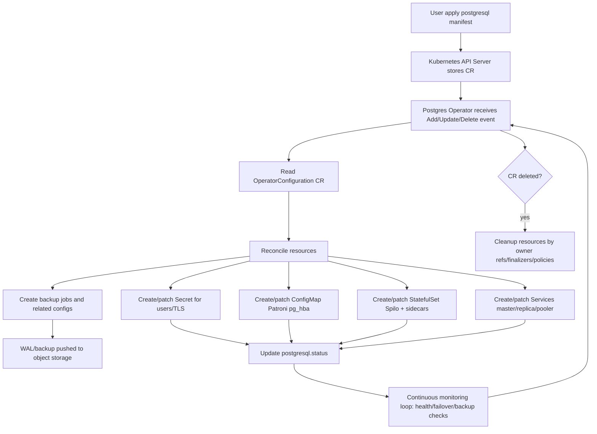
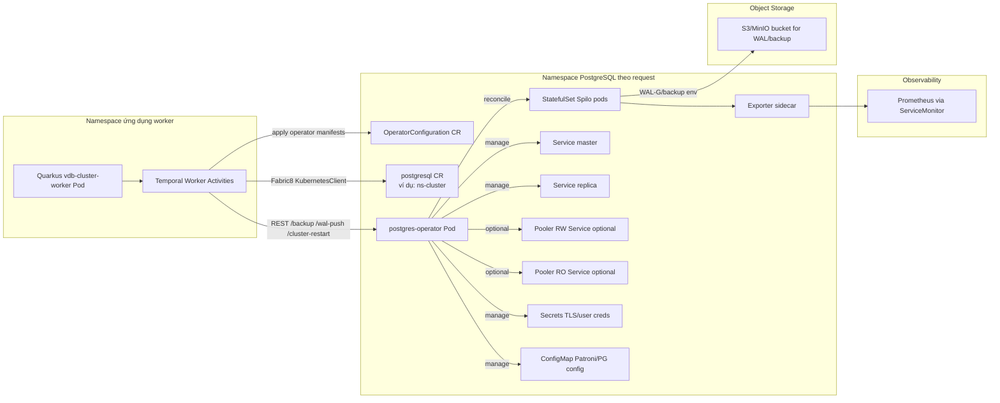

# ZALANDO OPERATOR + QUARKUS DEEP DIVE

## PHẦN 1: KIẾN THỨC NỀN TẢNG VỀ ZALANDO POSTGRES OPERATOR

### 1.1. Zalando Postgres Operator là gì?

Zalando Postgres Operator là một Kubernetes Operator mã nguồn mở do Zalando xây dựng để tự động hóa vòng đời PostgreSQL cluster trên Kubernetes, thay cho cách vận hành thủ công StatefulSet/Service/backup/failover rời rạc. Mục tiêu chính là biến việc vận hành PostgreSQL thành mô hình declarative: người dùng khai báo trạng thái mong muốn qua CRD, operator tự reconcile về trạng thái đó.

Các thành phần cốt lõi:
- **Operator Pod**: controller chính, theo dõi CRD và thực thi reconcile.
- **Spilo image**: một distribution PostgreSQL của Zalando, tích hợp **Patroni + PostgreSQL + tooling HA**.
- **Backup stack**:
  - Logical backup (pg_dump theo lịch cron).
  - Physical backup/PITR dựa trên WAL (thường qua WAL-G/WAL-E env trong Spilo).
- **Connection Pooler (PgBouncer)**: có thể bật theo cluster-level hoặc operator-level defaults.
- **Exporter/Monitoring sidecar**: PostgreSQL exporter để Prometheus scrape.

Nguyên lý hoạt động (Reconciliation Loop):
1. User `kubectl apply` CR như `postgresql`.
2. API Server lưu desired state.
3. Operator watch event Add/Update/Delete.
4. Operator so sánh desired state trong CR với actual state trong cluster (StatefulSet, Pod, Service, Secret, ConfigMap, PDB, CronJob backup...).
5. Operator tạo/sửa/xóa resource cần thiết để hội tụ.
6. Operator cập nhật `status` của CR.
7. Lặp lại liên tục theo event và resync period.

### 1.2. Các Custom Resource Definitions (CRDs) chính

#### `postgresqls.acid.zalan.do` (kind thường dùng: `postgresql`)
Đây là CRD mô tả một PostgreSQL cluster:
- Topology: `numberOfInstances`.
- Engine: `postgresql.version`, `postgresql.parameters`.
- Storage: `volume.size`, `volume.storageClass`.
- Identity: `users`, `databases`, grants.
- HA behavior: `patroni` options.
- Networking/security: pooler flags, service exposure, whitelist, TLS.
- Extensibility: `sidecars`, `env`.
- Restore/clone: `spec.clone`.

`status` thường phản ánh tình trạng cluster (state/message/conditions tùy version operator).

#### `operatorconfigurations.acid.zalan.do` (kind: `OperatorConfiguration`)
Đây là CRD cấu hình **toàn cục** cho postgres-operator trong namespace/operator scope:
- Image mặc định cho Spilo/pooler/logical-backup.
- Worker count, reconcile/resync behavior.
- Giới hạn min/max instance.
- Backup schedule mặc định.
- Kubernetes behavior: ownerReferences, PVC retention, anti-affinity, naming templates, secrets handling.
- Team/role policies, logging REST API, timeouts.

#### Mối quan hệ giữa hai CRD
- `OperatorConfiguration` đặt **global policy/defaults** cho mọi `postgresql` CR mà operator quản lý.
- `postgresql` CR là **instance-level desired state** cho từng cluster.
- Khi reconcile một `postgresql` CR, operator áp policy/default từ `OperatorConfiguration` và override bằng field cụ thể trong `spec` của CR nếu có.

### 1.3. Các phương thức/tính năng Operator cung cấp

1. **Triển khai tự động PostgreSQL cluster**
   - Cơ chế: đọc `postgresql.spec`, tạo StatefulSet/Pod/Service/Secret/ConfigMap/PDB...
   - Kích hoạt: chỉ cần apply `kind: postgresql`.

2. **Failover & switchover tự động (Patroni)**
   - Cơ chế: Patroni theo dõi leader health; khi master lỗi, bầu replica làm leader.
   - Kích hoạt: cluster Spilo + Patroni mặc định; có thể chỉnh qua `spec.patroni`.

3. **Scale out/in**
   - Cơ chế: thay đổi replica count ở StatefulSet và đồng bộ replication.
   - Kích hoạt: chỉnh `spec.numberOfInstances`.

4. **Rolling update**
   - Cơ chế: update dần pod theo chính sách StatefulSet/Patroni safety.
   - Kích hoạt: đổi `postgresql.version`, resource, image liên quan.

5. **Backup & Restore**
   - Logical backup:
     - Cơ chế: CronJob chạy pg_dump, upload S3/GCS/Azure.
     - Kích hoạt: config tại `OperatorConfiguration.logical_backup.*`.
   - Physical backup + PITR:
     - Cơ chế: WAL archive (WAL-G/WAL-E env) + restore từ WAL/base backup.
     - Kích hoạt: env backup trong Spilo và `spec.clone` khi restore.
   - Retention:
     - Cơ chế: policy retention theo bucket lifecycle hoặc config backup retention.

6. **Connection pooling (PgBouncer)**
   - Cơ chế: deploy pooler pod/service cho master/replica path.
   - Kích hoạt: `enableConnectionPooler`, `connectionPooler.*` hoặc default trong `OperatorConfiguration.connection_pooler.*`.

7. **Monitoring**
   - Cơ chế: exporter metrics + Service/ServiceMonitor để Prometheus scrape.
   - Kích hoạt: sidecar exporter + monitoring manifests.

8. **Quản lý user/database declarative**
   - Cơ chế: operator tạo role/database và secret credentials theo `users`, `databases`, grants.
   - Kích hoạt: định nghĩa trong `spec.users`, `spec.databases`, `grant-role`.

9. **Sidecar injection**
   - Cơ chế: thêm container tùy chỉnh vào pod Spilo.
   - Kích hoạt: `spec.sidecars[]`.

10. **Tự động dọn dẹp khi xóa CR**
    - Cơ chế: ownerReferences/finalizer/PVC retention policy.
    - Kích hoạt: điều khiển bởi `OperatorConfiguration.kubernetes.enable_owner_references`, `enable_finalizers`, `persistent_volume_claim_retention_policy`.

11. **Cập nhật cấu hình PostgreSQL**
    - Cơ chế: chỉnh `postgresql.parameters`, Patroni sync và rolling apply.
    - Kích hoạt: `spec.postgresql.parameters`.

12. **TLS**
    - Cơ chế: secret TLS cấp cert/key cho cluster.
    - Kích hoạt: `spec.tls.secretName`.

### 1.4. Cách kéo Open Source và triển khai (mô phỏng từ đầu)

Repo chính thức: [github.com/zalando/postgres-operator](https://github.com/zalando/postgres-operator)

Có 2 cách chính:
- `kubectl apply` manifests.
- Helm chart.

Ví dụ triển khai thủ công từng bước (theo pattern của project):

#### Bước 1: Apply CRD

```yaml
# Ví dụ (rút gọn): apply CRD trước khi tạo CR
# kubectl apply -f manifests/postgresql.crd.yaml
# kubectl apply -f manifests/operatorconfiguration.crd.yaml
```

#### Bước 2: Tạo RBAC

```yaml
apiVersion: v1
kind: ServiceAccount
metadata:
  name: postgres-operator
  namespace: demo-db
---
apiVersion: rbac.authorization.k8s.io/v1
kind: RoleBinding
metadata:
  name: postgres-operator-namespaced-resources
  namespace: demo-db
roleRef:
  apiGroup: rbac.authorization.k8s.io
  kind: ClusterRole
  name: postgres-operator-namespaced-resources
subjects:
  - kind: ServiceAccount
    name: postgres-operator
    namespace: demo-db
```

#### Bước 3: Tạo `OperatorConfiguration`

```yaml
apiVersion: acid.zalan.do/v1
kind: OperatorConfiguration
metadata:
  name: postgres-operator
  namespace: demo-db
configuration:
  docker_image: ghcr.io/zalando/spilo-17:3.2-p1
  workers: 8
  min_instances: -1
  max_instances: -1
  logical_backup:
    logical_backup_provider: s3
    logical_backup_schedule: "30 00 * * *"
    logical_backup_s3_bucket: my-bucket-url
  connection_pooler:
    connection_pooler_image: ghcr.io/zalando/pgbouncer:master-32
    connection_pooler_mode: transaction
    connection_pooler_max_db_connections: 60
    connection_pooler_number_of_instances: 2
```

Giải thích nhanh các field quan trọng:
- `docker_image`: Spilo image mặc định cho postgres pods.
- `workers`: số worker reconcile đồng thời.
- `min_instances/max_instances`: giới hạn scale cho cluster CR.
- `logical_backup_*`: bật lịch logical backup.
- `connection_pooler.*`: mặc định pooler toàn cục.

#### Bước 4: Deploy operator

```yaml
apiVersion: apps/v1
kind: Deployment
metadata:
  name: postgres-operator
  namespace: demo-db
spec:
  replicas: 1
  selector:
    matchLabels:
      app.kubernetes.io/name: postgres-operator
  template:
    metadata:
      labels:
        app.kubernetes.io/name: postgres-operator
    spec:
      serviceAccountName: postgres-operator
      containers:
        - name: postgres-operator
          image: ghcr.io/zalando/postgres-operator:v1.13.0
          env:
            - name: POSTGRES_OPERATOR_CONFIGURATION_OBJECT
              value: postgres-operator
```

#### Bước 5: Tạo PostgreSQL cluster mẫu

```yaml
apiVersion: acid.zalan.do/v1
kind: postgresql
metadata:
  name: demo-db-cluster
  namespace: demo-db
spec:
  teamId: demo-db
  numberOfInstances: 2
  postgresql:
    version: "17"
    parameters:
      superuser_reserved_connections: "3"
  volume:
    size: 50Gi
    storageClass: fast-ssd
  users:
    app_user: [LOGIN]
  databases:
    app_db: app_user
  allowedSourceRanges:
    - 10.0.0.0/8
  sidecars:
    - name: exporter
      image: quay.io/prometheuscommunity/postgres-exporter:v0.15.0
```

#### Bước 6: Kiểm tra
- `kubectl get postgresql -n demo-db`
- `kubectl get pods,svc,sts -n demo-db`
- test kết nối qua service master/replica.
- test failover: kill master pod, quan sát role switch.
- kiểm tra backup artifacts trong object storage.

#### Bước 7: Cleanup
- `kubectl delete postgresql demo-db-cluster -n demo-db`
- `kubectl delete deployment postgres-operator -n demo-db`
- xóa CRD nếu không dùng nữa.

### 1.5. Sơ đồ luồng hoạt động (Mermaid)



---

## PHẦN 2: PHÂN TÍCH DỰ ÁN QUARKUS HIỆN TẠI

### 2.1. Tổng quan dự án

`vdb-cluster-worker` là Quarkus worker service (tích hợp Temporal) dùng để **tự động hóa vận hành PostgreSQL cluster trên Kubernetes**, thay vì là ứng dụng business kết nối trực tiếp database bằng JDBC.

Điểm chính:
- Có dependency `quarkus-kubernetes-client` (`pom.xml`) và dùng Fabric8 để thao tác tài nguyên K8s/CR.
- Không thấy dependency `quarkus-jdbc-postgresql`, `quarkus-hibernate-orm`, `quarkus-flyway`, `quarkus-liquibase`.
- Không có cấu hình `quarkus.datasource.*` trong `application.properties`.
- Không thấy `quarkus-operator-sdk`/Java Operator SDK; project này là **operator automation client**, không phải tự viết operator controller.

### 2.2. File `OperatorConfiguration.java`

File: `src/main/java/com/engineering/temporal/response/k8s/OperatorConfiguration.java`

Phân tích:
- Package: `com.engineering.temporal.response.k8s`.
- Được annotate:
  - `@Group("acid.zalan.do")`
  - `@Version("v1")`
  - `@Kind("OperatorConfiguration")`
- Kế thừa: `CustomResource<Void, Void> implements Namespaced`.

Ý nghĩa:
- Đây là Java model tối giản để Fabric8 nhận biết loại CR `OperatorConfiguration` và thao tác CRUD theo typed resource.
- Không định nghĩa schema chi tiết cho `spec`/`status`; project chủ yếu apply YAML template trực tiếp rồi dùng model để get/delete object theo tên.

So sánh với `1_operator-configuration.yaml`:
- YAML chứa cấu hình cực chi tiết (logical backup, pooler, kubernetes behavior...).
- Java class chỉ đóng vai trò **type marker** cho API client, không map các trường configuration.

Vai trò trong Quarkus:
- Được dùng trong `PostgresOperatorActivitiesImpl` để:
  - delete config: `kubeClient.resources(OperatorConfiguration.class)...delete()`
  - wait until deleted: get by name và retry.

### 2.3. File `Postgresql.java`

File: `src/main/java/com/engineering/temporal/response/k8s/Postgresql.java`

Đây là model trung tâm đại diện CR `kind: postgresql` thuộc `acid.zalan.do/v1`.

Các điểm kỹ thuật:
- Annotate: `@Group("acid.zalan.do")`, `@Version("v1")`, `@Kind("postgresql")`.
- Kế thừa `CustomResource<Postgresql.spec, Postgresql.status>`.
- `spec` map tương đối đầy đủ các field project đang dùng:
  - topology: `numberOfInstances`
  - storage/resources: `volume`, `resources`
  - engine: `postgresql.version`, `parameters`
  - HA/tls: `patroni`, `tls`
  - identity: `users`, `databases`, `grant-role`
  - ext: `sidecars`, `env`, `clone`
  - pooler: `enableConnectionPooler`, `connectionPooler.*`
- `status` hiện chỉ gồm `state`, `message` (rút gọn).

So sánh với `2_postgresql-deployment.yaml`:
- Placeholder trong YAML được replace runtime rồi parse về `Postgresql`.
- Các trường trong YAML (`sidecars.exporter`, `tls.secretName`, backup env, patroni failsafe...) đều map được trong model.

Cách sử dụng:
- Dùng làm model tạo/patch/get/delete CR trong `PostgresClusterActivitiesImpl`.
- Có logic dynamic merge:
  - thêm `postgresql.parameters` từ request.
  - chèn patch pooler từ `2x_advance-pooler-deployment.yaml`.
  - gắn `spec.clone` để restore PITR-like flow.

### 2.4. File `vdb-cluster-worker.yaml` (mới)

File này **không phải manifest `acid.zalan.do`**, mà là cấu hình build/deploy pipeline cho chính app `vdb-cluster-worker` (nhiều khả năng phục vụ CI/CD chart values).

Nhận định:
- Chứa `config` build image (`Dockerfile.jvm`, `build-jar.sh`).
- Chứa `deploy_config` cho `dev/stg`: namespace app, replica, init container, envoy sidecar, secret mount, probes, resources...
- Không khai báo `apiVersion/kind` Kubernetes chuẩn của Postgres CR.

Liên hệ với `Postgresql.java` và `2_postgresql-deployment.yaml`:
- `vdb-cluster-worker.yaml`: deploy **worker app**.
- `2_postgresql-deployment.yaml`: template deploy **Postgres cluster CR**.
- `Postgresql.java`: model Java để thao tác CR tương ứng.

Mục đích kiến trúc:
- Worker app chạy độc lập, gọi K8s API để quản lý cluster Postgres theo workflow.
- Không phải “một cluster PostgreSQL riêng cho worker” trong file này; nếu có cluster riêng thì nằm ở các CR `postgresql` được worker apply runtime.

### 2.5. File `1_operator-configuration.yaml` và `2_postgresql-deployment.yaml`

#### `1_operator-configuration.yaml` (đầy đủ)

```yaml
# Postgres Operator Configuration
apiVersion: "acid.zalan.do/v1"
kind: OperatorConfiguration
metadata:
  name: postgres-operator
  namespace: <namespace>
  labels:
    app.kubernetes.io/name: postgres-operator
    app.kubernetes.io/instance: postgres-operator
configuration:
  crd_categories:
    - all
  docker_image: <spilo-image-path>
  enable_crd_registration: false
  enable_lazy_spilo_upgrade: false
  enable_pgversion_env_var: true
  enable_shm_volume: true
  enable_spilo_wal_path_compat: false
  enable_team_id_clustername_prefix: false
  etcd_host: ""
  max_instances: -1
  min_instances: -1
  repair_period: 5m
  resync_period: 30m
  workers: 8
  users:
    enable_password_rotation: false
    password_rotation_interval: 90
    password_rotation_user_retention: 180
    replication_username: vngrep
    super_username: postgres
  major_version_upgrade:
    major_version_upgrade_mode: manual
    minimal_major_version: "13"
    target_major_version: "17"
  kubernetes:
    pod_service_account_name: postgres-pod
    pod_service_account_definition: '
      {
        "apiVersion": "v1",
        "kind": "ServiceAccount",
        "metadata": {
          "name": "postgres-pod"
        },
        "imagePullSecrets": [
          {
            "name": "vng-vcr-creds"
          }
        ]
      }'
    oauth_token_secret_name: postgres-operator
    cluster_domain: cluster.local
    cluster_labels:
      application: spilo
    cluster_name_label: cluster-name
    enable_cross_namespace_secret: false
    enable_finalizers: false
    enable_init_containers: true
    enable_owner_references: false
    enable_persistent_volume_claim_deletion: true
    enable_pod_antiaffinity: true
    enable_pod_disruption_budget: true
    enable_readiness_probe: false
    enable_secrets_deletion: true
    enable_sidecars: true
    pdb_master_label_selector: true
    pdb_name_format: postgres-{cluster}-pdb
    persistent_volume_claim_retention_policy:
      when_deleted: delete
      when_scaled: delete
    pod_antiaffinity_preferred_during_scheduling: false
    pod_antiaffinity_topology_key: kubernetes.io/hostname
    pod_management_policy: ordered_ready
    pod_role_label: spilo-role
    pod_terminate_grace_period: 5m
    secret_name_template: '{username}.{cluster}.creds.{tprkind}'
    share_pgsocket_with_sidecars: false
    spilo_allow_privilege_escalation: true
    spilo_image_pull_policy: <spilo-image-pull-policy>
    spilo_privileged: false
    storage_resize_mode: pvc
    watched_namespace: '<namespace>'
  postgres_pod_resources:
    default_cpu_limit: "1"
    default_cpu_request: 100m
    default_memory_limit: 500Mi
    default_memory_request: 100Mi
    min_cpu_limit: 250m
    min_memory_limit: 250Mi
  timeouts:
    patroni_api_check_interval: 1s
    patroni_api_check_timeout: 5s
    pod_deletion_wait_timeout: 10m
    pod_label_wait_timeout: 10m
    ready_wait_interval: 3s
    ready_wait_timeout: 30s
    resource_check_interval: 3s
    resource_check_timeout: 10m
  load_balancer:
    db_hosted_zone: db.example.com
    enable_master_load_balancer: false
    enable_master_pooler_load_balancer: false
    enable_replica_load_balancer: false
    enable_replica_pooler_load_balancer: false
    external_traffic_policy: Cluster
    master_dns_name_format: '{cluster}.{namespace}.{hostedzone}'
    master_legacy_dns_name_format: '{cluster}.{team}.{hostedzone}'
    replica_dns_name_format: '{cluster}-repl.{namespace}.{hostedzone}'
    replica_legacy_dns_name_format: '{cluster}-repl.{team}.{hostedzone}'
  aws_or_gcp:
    aws_region: eu-central-1
    enable_ebs_gp3_migration: false
  logical_backup:
    logical_backup_cronjob_environment_secret: ""
    logical_backup_docker_image: ghcr.io/zalando/postgres-operator/logical-backup:v1.13.0
    logical_backup_job_prefix: logical-backup-
    logical_backup_provider: s3
    logical_backup_s3_access_key_id: ""
    logical_backup_s3_bucket: my-bucket-url
    logical_backup_s3_bucket_prefix: spilo
    logical_backup_s3_endpoint: ""
    logical_backup_s3_region: ""
    logical_backup_s3_retention_time: ""
    logical_backup_s3_secret_access_key: ""
    logical_backup_s3_sse: AES256
    logical_backup_schedule: 30 00 * * *
  debug:
    debug_logging: true
    enable_database_access: true
  teams_api:
    enable_admin_role_for_users: false
    enable_postgres_team_crd: false
    enable_postgres_team_crd_superusers: false
    enable_team_member_deprecation: false
    enable_team_superuser: false
    enable_teams_api: false
    pam_role_name: vngpam
    postgres_superuser_teams:
      - postgres_superusers
    protected_role_names:
      - admin
      - cron_admin
      - postgres
      - vngrep
      - vngpooler
    role_deletion_suffix: _deleted
    team_admin_role: admin
    team_api_role_configuration:
      log_statement: all
  logging_rest_api:
    api_port: 8080
    cluster_history_entries: 1000
    ring_log_lines: 100
  connection_pooler:
    connection_pooler_default_cpu_limit: "1"
    connection_pooler_default_cpu_request: 500m
    connection_pooler_default_memory_limit: 100Mi
    connection_pooler_default_memory_request: 100Mi
    connection_pooler_image: <pooler-image-path>
    connection_pooler_max_db_connections: 60
    connection_pooler_mode: transaction
    connection_pooler_number_of_instances: 2
    connection_pooler_schema: vngpooler
    connection_pooler_user: vngpooler
  patroni:
    enable_patroni_failsafe_mode: true
```

Điểm đặc biệt:
- Cấu hình rất “production-like”: logical backup, pooler defaults, timeout/tuning, anti-affinity, PVC retention.
- `enable_owner_references: false` + `enable_finalizers: false` nghĩa là cleanup phụ thuộc policy/logic khác, không thuần ownerRef chain.

#### `2_postgresql-deployment.yaml` (đầy đủ)

```yaml
apiVersion: "acid.zalan.do/v1"
kind: postgresql
metadata:
  name: <namespace>-cluster
  namespace: <namespace>
spec:
  teamId: <namespace>

  resources:
    requests:
      cpu: 500m
      memory: 512Mi
    limits:
      cpu: 2000m
      memory: 4Gi
  volume:
    size: <volume-size>Gi
    storageClass: <storage-class>
  numberOfInstances: <number-of-instances>
  postgresql:
    version: "<postgresql-version>"
    parameters:
      extwlist.extensions: ""
      superuser_reserved_connections: "3"
  patroni:
    failsafe_mode: true
  # Pod Placement
  nodeAffinity:
    requiredDuringSchedulingIgnoredDuringExecution:
      nodeSelectorTerms:
        - matchExpressions:
            - key: type
              operator: In
              values:
                - data
            - key: id
              operator: In
              values:
                - <id-to-selector>
  tolerations:
    - key: "type"
      operator: "Equal"
      value: "data"
      effect: "NoSchedule"
    - key: "id"
      operator: "Equal"
      value: "<id-to-selector>"
      effect: "NoSchedule"

  users:
    "<username>":
    - NOINHERIT
    - LOGIN
    - CREATEROLE
    - CREATEDB
  databases:
    "<database>": "<username>"
  grant-role:
    "<username>":
      parameters:
        extwlist.extensions: "plpgsql,pg_stat_statements,timescaledb,postgis,postgis_topology,postgis_raster,pg_trgm,hstore,citext,uuid-ossp,pgcrypto,pg_partman,vector,pg_repack,postgres_fdw,tablefunc,fuzzystrmatch,btree_gin,btree_gist,cube,earthdistance,dict_int,dict_xsyn,isn,lo,ltree,unaccent,intarray,pltcl,seg,tcn,tsm_system_rows,tsm_system_time,pg_stat_kcache,pg_permissions,postgis_tiger_geocoder,set_user"

  sidecars: 
  - name: "exporter"
    image: "<exporter-image>"
    ports:
      - name: exporter
        containerPort: 9187
        protocol: TCP
    env:
      - name: DATA_SOURCE_URI
        value: "localhost:5432/?sslmode=disable"
      - name: DATA_SOURCE_USER
        value: "$(POSTGRES_USER)"
      - name: DATA_SOURCE_PASS
        value: "$(POSTGRES_PASSWORD)"
      - name: PG_EXPORTER_AUTO_DISCOVER_DATABASES
        value: "true"
    resources:
      limits:
        cpu: 500m
        memory: 256M
      requests:
        cpu: 100m
        memory: 200M

  spiloFSGroup: 103
  tls:
    secretName: vng-tls-<namespace>-cluster-certs

  env:
    - name: DISABLE_BACKUP_CLEANUP
      value: "true"
    - name: BACKUP_CALLBACK_URL
      value: vdb-cluster-worker.vdb-cluster-worker/backup/sync-info
    - name: WAL_BUCKET_SCOPE_PREFIX
      value: "backup-"
    - name: WAL_BUCKET_SCOPE_SUFFIX
      value: ""
    - name: USE_WALG_BACKUP
      value: "true"
    - name: USE_WALG_RESTORE
      value: "true"
    - name: WAL_S3_BUCKET
      value: "<bucket-name>"
    - name: AWS_ACCESS_KEY_ID
      value: "<access-key>"
    - name: AWS_SECRET_ACCESS_KEY
      value: "<secret-access-key>"
    - name: AWS_ENDPOINT
      value: "<endpoint>"
    - name: AWS_S3_FORCE_PATH_STYLE
      value: "true"
    - name: WALG_DISABLE_S3_SSE
      value: "true"
    - name: ENABLE_WAL_PUSH
      value: "false"
    - name: USE_WALE_REPLICA_CREATE
      value: "false"
```

Ánh xạ với phần nền tảng:
- Có HA (`patroni.failsafe_mode`), sidecar exporter, TLS secret, backup env WAL-G.
- Có declarative users/databases.
- Có topology/placement chi tiết (affinity + toleration).
- Chưa bật pooler trực tiếp trong file này (được patch động từ file `2x_advance-pooler-deployment.yaml` khi request bật pooler).

### 2.6. Tích hợp Quarkus với Operator

#### Kết nối Quarkus với PostgreSQL cluster do operator quản lý
- Project **không** cấu hình datasource JDBC (`quarkus.datasource.jdbc.url` không tồn tại).
- Không thấy luồng app kết nối SQL trực tiếp; app đóng vai trò orchestration/control-plane.

#### Secret và cấu hình
- `application.properties` chứa config cho TLS secret, image registry credentials và operator images (`postgres.operator.*`, `postgres.secret.cluster.*`).
- `PostgresClusterConfigRefer` inject các config này qua `@ConfigProperty`.
- `PostgresClusterActivitiesImpl.applySecret()` sinh `1_tls-user-secret.yaml` với:
  - TLS secret (`kubernetes.io/tls`)
  - user credential secret (`<username>.<cluster>.creds.postgresql`)

#### Migration (Flyway/Liquibase)
- Không thấy dependency và cấu hình Flyway/Liquibase.
- Không có evidence migration tự động khi startup.

#### Kubernetes Client / Operator SDK
- Dùng `quarkus-kubernetes-client` + Fabric8 typed resources.
- `KubeConfig.createK8sClient()` tạo `KubernetesClient` từ file kubeconfig (`kubeconfig-file=postgres-dev.txt`).
- Không sử dụng `quarkus-operator-sdk` (tức app không chạy reconciliation loop kiểu custom operator riêng).

#### Tương tác với postgres-operator REST API
- `OperatorEndpointResolver`: endpoint nội bộ `http://postgres-operator.<namespace>:8080`.
- `OperatorApiService` gọi:
  - `GET /cluster-restart/{namespace}/{clusterName}`
  - `POST /backup/{namespace}/{clusterName}`
  - `POST /wal-push/{namespace}/{clusterName}`
- `PostgresClusterActivitiesImpl` dùng các API này cho reboot/backup/incremental backup.

---

## PHẦN 3: SO SÁNH VÀ CÁCH ZALANDO ĐÓNG GÓP TRONG DỰ ÁN QUARKUS

### 3.1. Tổng hợp instance PostgreSQL được định nghĩa

Trong repo hiện tại:
- Có **1 template chính** để tạo cluster: `2_postgresql-deployment.yaml` (tên runtime dạng `<namespace>-cluster`).
- Có thêm template patch cho pooler (`2x_advance-pooler-deployment.yaml`) và clone (`2x_advance-clone-deployment.yaml`).
- `vdb-cluster-worker.yaml` không tạo PostgreSQL instance.

Số cluster thực tế sẽ phụ thuộc số namespace/request runtime do workflow tạo, không cố định bởi static manifest.

### 3.2. Kiến trúc vai trò

- **Worker Quarkus**: nhận workflow request, dựng YAML template, apply CR/Service/Secret.
- **Postgres Operator**: reconcile CR sang StatefulSet/Pods/Services thực tế.
- **Postgres clusters**: có thể nhiều cluster theo namespace (`<namespace>-cluster`).
- **Optional pooler path**: bật theo request (`poolerEnable=true`) để tạo endpoints pooler RW/RO.

### 3.3. So sánh triển khai hiện tại với mẫu best-practice phần 1

Tính năng đang dùng tốt:
- Declarative provisioning qua CR `postgresql`.
?- HA/failover nhờ Spilo/Patroni.
- Backup tích hợp WAL env + API trigger backup/incremental backup.
- Monitoring exporter + ServiceMonitor manifest (`3_monitoring-config.yaml`).
- TLS secret cho cluster.
- Connection pooler có hỗ trợ bật động.

Điểm mạnh:
- Tự động hóa sâu qua Temporal workflows.
- Quản trị cluster từ một control app thống nhất.
- Có readiness/wait loops để kiểm tra statefulset/pod role/LB readiness.

Rủi ro/hạn chế:
- `application.properties` đang chứa nhiều secret nhạy cảm dạng plaintext/base64 -> cần chuyển sang secret manager.
- Không có datasource/Flyway trong app (không xấu nếu chủ đích control-plane), nhưng nếu sau này thêm nghiệp vụ DB thì thiếu migration guardrails.
- `OperatorConfiguration` đặt `enable_owner_references: false` và `enable_finalizers: false` có thể làm cleanup lifecycle kém tự động hơn.
- Pooler không mặc định bật cho mọi cluster; nếu workload có nhiều kết nối ngắn mà tắt pooler dễ gây áp lực connection.

### 3.4. Sơ đồ kiến trúc dự án (Mermaid)



Ghi chú:
- `vdb-cluster-worker.yaml` đại diện deployment của node `A` (worker app), không phải `PC`.
- `PC` được tạo động từ template `2_postgresql-deployment.yaml`.

---

## PHẦN 4: TỔNG KẾT VÀ KHUYẾN NGHỊ

Zalando Postgres Operator đóng vai trò lõi về độ tin cậy và tự động hóa cho hệ thống này: từ provisioning cluster, HA/failover, backup, monitoring đến mở rộng pooler/network endpoints. Quarkus worker đóng vai trò orchestrator cấp cao, giúp “productize” vận hành PostgreSQL bằng workflow thay vì thao tác thủ công.

Những file/hàm cần lưu ý khi chỉnh sửa:
- `OperatorConfiguration.java`: type model cho CR cấu hình toàn cục; tác động tới thao tác delete/wait của operator config.
- `Postgresql.java`: model CR chính, ảnh hưởng trực tiếp tất cả flow create/scale/update/restore.
- `PostgresOperatorActivitiesImpl`: apply RBAC/config/deployment operator.
- `PostgresClusterActivitiesImpl`: apply CR, secret, pooler, monitoring, backup/update params.
- `1_operator-configuration.yaml` và `2_postgresql-deployment.yaml`: nguồn policy/runtime template quan trọng nhất.

Checklist vận hành đề xuất:
1. Xác nhận logical backup schedule và bucket retention hoạt động.
2. Kiểm tra WAL archive/PITR restore test định kỳ.
3. Theo dõi replication lag, failover time, pod role labels.
4. Theo dõi pooler saturation (`maxDBConnections`, active/idle client stats).
5. Kiểm tra version compatibility khi nâng cấp operator/Spilo/PostgreSQL.
6. Khi đổi PostgreSQL major version, dùng rollout plan + backup + restore drill.

Đề xuất cải tiến:
- Chuyển toàn bộ secrets trong `application.properties` sang K8s Secret/External Secrets/Vault.
- Bật pooler mặc định cho workload có concurrency cao.
- Cân nhắc bật finalizer/ownerRef phù hợp để lifecycle cleanup rõ ràng hơn.
- Bổ sung dashboard/alert cho backup freshness, replica lag, WAL archive failures.
- Nếu tương lai app cần đọc/ghi DB trực tiếp, thêm `quarkus-jdbc-postgresql` + Flyway/Liquibase theo chuẩn CI/CD.

