# Luồng tạo cluster PostgreSQL (gosgtgres) – Workflow Temporal

## 1. Sơ đồ luồng (Mermaid)

```mermaid
flowchart TD
    Start([Workflow Input]) --> genUuid["genUuid"]
    genUuid -->|"uuid (transactionId)"| CreateTrans1["CreatePostgreTransactionEntity (lần 1)"]
    CreateTrans1 --> CreateTrans2["CreatePostgreTransactionEntity (lần 2) - lưu requestData"]
    CreateTrans2 --> RecordHist["RecordPostgreClusterHistory"]
    RecordHist --> InitCluster["InitPostgreCluster"]
    InitCluster -->|"cluster object (BUILDING)"| Save1["SavePostgreCluster (lần 1)"]
    Save1 -->|"cluster (có transactionId)"| CreateBackup["CreateBackupDatabase"]
    CreateBackup --> BackendWF["CreatePostgresClusterBackendWorkflow"]
    BackendWF -->|"nodeGroupIds, privateRWLBEndpoint, ..."| Sync["syncBackend (Signaled)"]
    Sync --> Get1["GetClusterEntityById (lần 1)"]
    Get1 -->|"cluster cũ"| Save2["SavePostgreCluster (lần 2) - thêm nodeGroupIds"]
    Save2 --> Get2["GetClusterEntityById (lần 2)"]
    Get2 -->|"cluster (đã có nodeGroupIds)"| Save3["SavePostgreCluster (lần 3) - thêm privateRwIp, systemBackup..."]
    Save3 --> UpdateSecGrp["UpdateSecGroupRules"]
    UpdateSecGrp --> AddDNS["AddPrivateDnsRecordWorkflow"]
    AddDNS -->|"domainName"| Get3["GetClusterEntityById (lần 3)"]
    Get3 -->|"cluster"| Save4["SavePostgreCluster (lần 4) - thêm domainName, status WAIT_BILLING"]
    Save4 --> Notify["NotifyRabbitMQActionCluster"]
    Notify --> UpdateTrans["UpdatePostgreTransactionEntity"]
    UpdateTrans --> GetClusterFinal["GetClusterById"]
    GetClusterFinal --> End([Workflow Output])
```



## 2. Dữ liệu tái cấu trúc (Input/Output từng hàm)

### 2.1. genUuid

- **Input:** (không có)
- **Output:**

```json
["uuid"]
```

Giá trị thực tế: `"12c69162-2df9-4791-ad39-71931d6e9216"` (dùng làm `transactionId`)

### 2.2. CreatePostgreTransactionEntity (lần 1)

- **Input:**

```json
{
  "netIds": ["sub-a76b9a89-d971-4fa3-8881-7039c9cb9b70"]
}
```

### 2.3. CreatePostgreTransactionEntity (lần 2)

- **Input:**

```json
[
  {
    "id": "12c69162-2df9-4791-ad39-71931d6e9216",
    "resourceId": "pg-0c5bcd86-d7cc-48d1-9a48-acc790c574c9",
    "description": "cluster: thanh-postges-12, cpu: 2, ram: 4 GB, flavor: vdb.s-general-2x4, engine: PostgreSQL, version: 17, storage-type: Gen2-NVMe-IOPS5000, storage-size: 20 GB, number-of-nodes: 3",
    "action": "CREATE-POSTGRE",
    "status": "PROCESSING",
    "createdAt": null,
    "updatedAt": null,
    "closedAt": null,
    "requestData": "<xem bên dưới>",
    "message": null,
    "billingTransactionId": "f7f95480-5415-43be-99b1-907ebdeb3ce6"
  }
]
```

**requestData** (đã giải mã):

```json
{
  "id": "pg-0c5bcd86-d7cc-48d1-9a48-acc790c574c9",
  "userId": 53888,
  "projectId": "pro-d024077d-46f2-48f6-b362-d677cfa8a7ec",
  "name": "thanh-postges-12",
  "locateZoneId": "HCM03-1A",
  "packageId": "pgp-51e30a6d-bc9e-4ffb-843f-11e950de12e8",
  "volumeTypeId": "pgst-63e28e83-165c-4a6d-8cd4-36ed37f1b65d",
  "volumeSize": 20,
  "encryptionVolume": false,
  "numberOfNodes": 3,
  "user": {
    "name": "thanhttn",
    "password": "CNt0Ay_lSBU3",
    "databases": [{"name": "database_1"}]
  },
  "databases": [{"name": "database_1", "characterSet": "utf8", "collate": "utf8_general_ci"}],
  "datastoreVersion": "17",
  "netIds": ["sub-a76b9a89-d971-4fa3-8881-7039c9cb9b70"],
  "configId": "",
  "publicAccess": false,
  "backupAuto": true,
  "backupDuration": 2,
  "backupTime": "00:00",
  "enableProxies": false,
  "backupLocationId": "bk-des-b578842f-7d94-46d0-8365-7e292298fd7b",
  "backupPolicyId": "bk-pol-83f3c1d2-52bf-4096-b7f2-6b2d84db71ea",
  "flavorSku": "db.s-general-2x4",
  "cesSku": "ces.db.s-general-2x4",
  "storageTypeSku": "Gen2-NVMe-IOPS5000.dbaas",
  "billingTransactionId": "f7f95480-5415-43be-99b1-907ebdeb3ce6",
  "packageDto": {
    "id": "pgp-51e30a6d-bc9e-4ffb-843f-11e950de12e8",
    "name": "vdb.s-general-2x4",
    "isDefault": false,
    "description": "Instance types for common workloads, optimized for cost and flexibility",
    "networkPerformance": "Up to 1 Gbps",
    "packageSku": "db.s-general-2x4",
    "cesSku": "ces.db.s-general-2x4",
    "ram": 4,
    "vcpus": 2,
    "platformType": "code-s",
    "order": 1,
    "status": "ACTIVE",
    "locateZoneId": "HCM03-1A",
    "zoneUUID": "22D855D0-EF84-11F0-B558-0800200C9A66",
    "backupSize": 50
  },
  "storageTypeDto": {
    "id": "pgst-63e28e83-165c-4a6d-8cd4-36ed37f1b65d",
    "name": "Gen2-NVMe-IOPS5000",
    "type": "Gen2-NVMe-IOPS5000",
    "volumeTypeSku": "Gen2-NVMe-IOPS5000.dbaas",
    "order": 2,
    "status": "ACTIVE",
    "minVolumeSize": 20,
    "maxVolumeSize": 5000,
    "zoneId": "HCM03-1A",
    "iops": 5000,
    "description": "NVME",
    "volumeTypeZoneId": "63D9E33A-34F3-11EE-BE56-0242AC120002",
    "backendId": "vtype-7a7a8610-34f5-11ee-be56-0242ac120002"
  }
}
```

### 2.4. RecordPostgreClusterHistory

- **Input:**

```json
[
  "CREATE-CLUSTER",
  "PROCESSING",
  null,
  "cluster: thanh-postges-12, cpu: 2, ram: 4 GB, flavor: vdb.s-general-2x4, engine: PostgreSQL, version: 17, storage-type: Gen2-NVMe-IOPS5000, storage-size: 20 GB, number-of-nodes: 3",
  53888,
  "pro-d024077d-46f2-48f6-b362-d677cfa8a7ec",
  "pg-0c5bcd86-d7cc-48d1-9a48-acc790c574c9",
  "12c69162-2df9-4791-ad39-71931d6e9216"
]
```

- **Output:** (không có)

### 2.5. InitPostgreCluster

- **Input:**

```json
[
  {
    "id": "pg-0c5bcd86-d7cc-48d1-9a48-acc790c574c9",
    "userId": 53888,
    "projectId": "pro-d024077d-46f2-48f6-b362-d677cfa8a7ec",
    "name": "thanh-postges-12",
    "locateZoneId": "HCM03-1A",
    "packageId": "pgp-51e30a6d-bc9e-4ffb-843f-11e950de12e8",
    "volumeTypeId": "pgst-63e28e83-165c-4a6d-8cd4-36ed37f1b65d",
    "volumeSize": 20,
    "encryptionVolume": false,
    "numberOfNodes": 3,
    "user": {
      "name": "thanhttn",
      "password": "CNt0Ay_lSBU3",
      "databases": [{"name": "database_1"}]
    },
    "databases": [{"name": "database_1", "characterSet": "utf8", "collate": "utf8_general_ci"}],
    "datastoreVersion": "17",
    "netIds": ["sub-a76b9a89-d971-4fa3-8881-7039c9cb9b70"],
    "configId": "",
    "publicAccess": false,
    "backupAuto": true,
    "backupDuration": 2,
    "backupTime": "00:00",
    "enableProxies": false,
    "poolMaxConnections": null,
    "backupLocationId": "bk-des-b578842f-7d94-46d0-8365-7e292298fd7b",
    "backupPolicyId": "bk-pol-83f3c1d2-52bf-4096-b7f2-6b2d84db71ea",
    "flavorSku": "db.s-general-2x4",
    "cesSku": "ces.db.s-general-2x4",
    "storageTypeSku": "Gen2-NVMe-IOPS5000.dbaas",
    "billingTransactionId": "f7f95480-5415-43be-99b1-907ebdeb3ce6",
    "metadata": null,
    "packageDto": {
      "id": "pgp-51e30a6d-bc9e-4ffb-843f-11e950de12e8",
      "name": "vdb.s-general-2x4",
      "isDefault": false,
      "description": "Instance types for common workloads, optimized for cost and flexibility",
      "networkPerformance": "Up to 1 Gbps",
      "packageSku": "db.s-general-2x4",
      "cesSku": "ces.db.s-general-2x4",
      "ram": 4,
      "vcpus": 2,
      "platformType": "code-s",
      "order": 1,
      "status": "ACTIVE",
      "locateZoneId": "HCM03-1A",
      "zoneUUID": "22D855D0-EF84-11F0-B558-0800200C9A66",
      "backupSize": 50
    },
    "storageTypeDto": {
      "id": "pgst-63e28e83-165c-4a6d-8cd4-36ed37f1b65d",
      "name": "Gen2-NVMe-IOPS5000",
      "type": "Gen2-NVMe-IOPS5000",
      "volumeTypeSku": "Gen2-NVMe-IOPS5000.dbaas",
      "order": 2,
      "status": "ACTIVE",
      "minVolumeSize": 20,
      "maxVolumeSize": 5000,
      "zoneId": "HCM03-1A",
      "iops": 5000,
      "description": "NVME",
      "volumeTypeZoneId": "63D9E33A-34F3-11EE-BE56-0242AC120002",
      "backendId": "vtype-7a7a8610-34f5-11ee-be56-0242ac120002"
    },
    "backupPointId": null,
    "isPoc": null
  }
]
```

- **Output:**

```json
[
  {
    "id": "pg-0c5bcd86-d7cc-48d1-9a48-acc790c574c9",
    "name": "thanh-postges-12",
    "projectId": "pro-d024077d-46f2-48f6-b362-d677cfa8a7ec",
    "status": "BUILDING",
    "createdAt": "2026-05-12T03:31:43.139+00:00",
    "updatedAt": null,
    "deletedAt": null,
    "vpcId": "net-37bba3f1-5010-4bb9-9db1-1ec918fa881a",
    "subnetId": "sub-a76b9a89-d971-4fa3-8881-7039c9cb9b70",
    "portalUserId": 53888,
    "zoneId": "HCM03-1A",
    "packageId": "pgp-51e30a6d-bc9e-4ffb-843f-11e950de12e8",
    "storageTypeId": "pgst-63e28e83-165c-4a6d-8cd4-36ed37f1b65d",
    "storageSize": 20,
    "configGroupId": null,
    "numberOfNodes": 3,
    "encryptVolume": false,
    "nodeGroupId": null,
    "version": "17",
    "publicAccess": false,
    "port": 5432,
    "privateRwIp": null,
    "publicRwIp": null,
    "privateRoIp": null,
    "publicRoIp": null,
    "backupAuto": false,
    "backupTime": null,
    "backupDuration": null,
    "transactionId": null,
    "enableProxies": false,
    "poolMaxConnections": null,
    "username": "thanhttn",
    "domainName": null,
    "applyConfigSystem": true,
    "paramList": null,
    "enableSystemBackup": true,
    "systemBackupBucket": null,
    "systemBackupEndpoint": null
  }
]
```

### 2.6. SavePostgreCluster (lần 1)

- **Input:** (output của InitPostgreCluster + transactionId)

```json
[
  {
    "id": "pg-0c5bcd86-d7cc-48d1-9a48-acc790c574c9",
    "name": "thanh-postges-12",
    "projectId": "pro-d024077d-46f2-48f6-b362-d677cfa8a7ec",
    "status": "BUILDING",
    "createdAt": "2026-05-12T03:31:43.139+00:00",
    "updatedAt": "2026-05-12T03:31:43.199+00:00",
    "deletedAt": null,
    "vpcId": "net-37bba3f1-5010-4bb9-9db1-1ec918fa881a",
    "subnetId": "sub-a76b9a89-d971-4fa3-8881-7039c9cb9b70",
    "portalUserId": 53888,
    "zoneId": "HCM03-1A",
    "packageId": "pgp-51e30a6d-bc9e-4ffb-843f-11e950de12e8",
    "storageTypeId": "pgst-63e28e83-165c-4a6d-8cd4-36ed37f1b65d",
    "storageSize": 20,
    "configGroupId": null,
    "numberOfNodes": 3,
    "encryptVolume": false,
    "nodeGroupId": null,
    "version": "17",
    "publicAccess": false,
    "port": 5432,
    "privateRwIp": null,
    "publicRwIp": null,
    "privateRoIp": null,
    "publicRoIp": null,
    "backupAuto": false,
    "backupTime": null,
    "backupDuration": null,
    "transactionId": "12c69162-2df9-4791-ad39-71931d6e9216",
    "enableProxies": false,
    "poolMaxConnections": null,
    "username": "thanhttn",
    "domainName": null,
    "applyConfigSystem": true,
    "paramList": null,
    "enableSystemBackup": true,
    "systemBackupBucket": null,
    "systemBackupEndpoint": null
  }
]
```

- **Output:** (thêm `updatedAt`)

```json
[
  {
    "id": "pg-0c5bcd86-d7cc-48d1-9a48-acc790c574c9",
    "name": "thanh-postges-12",
    "projectId": "pro-d024077d-46f2-48f6-b362-d677cfa8a7ec",
    "status": "BUILDING",
    "createdAt": "2026-05-12T03:31:43.139+00:00",
    "updatedAt": "2026-05-12T03:31:43.199+00:00",
    "deletedAt": null,
    "vpcId": "net-37bba3f1-5010-4bb9-9db1-1ec918fa881a",
    "subnetId": "sub-a76b9a89-d971-4fa3-8881-7039c9cb9b70",
    "portalUserId": 53888,
    "zoneId": "HCM03-1A",
    "packageId": "pgp-51e30a6d-bc9e-4ffb-843f-11e950de12e8",
    "storageTypeId": "pgst-63e28e83-165c-4a6d-8cd4-36ed37f1b65d",
    "storageSize": 20,
    "configGroupId": null,
    "numberOfNodes": 3,
    "encryptVolume": false,
    "nodeGroupId": null,
    "version": "17",
    "publicAccess": false,
    "port": 5432,
    "privateRwIp": null,
    "publicRwIp": null,
    "privateRoIp": null,
    "publicRoIp": null,
    "backupAuto": false,
    "backupTime": null,
    "backupDuration": null,
    "transactionId": "12c69162-2df9-4791-ad39-71931d6e9216",
    "enableProxies": false,
    "poolMaxConnections": null,
    "username": "thanhttn",
    "domainName": null,
    "applyConfigSystem": true,
    "paramList": null,
    "enableSystemBackup": true,
    "systemBackupBucket": null,
    "systemBackupEndpoint": null
  }
]
```

### 2.7. CreateBackupDatabase

- **Input:**

```json
[
  53888,
  {
    "databaseId": "pg-0c5bcd86-d7cc-48d1-9a48-acc790c574c9",
    "description": "Created by vDB.",
    "backupEnabled": true,
    "backupPolicyId": "bk-pol-83f3c1d2-52bf-4096-b7f2-6b2d84db71ea",
    "backupDestinationId": "bk-des-b578842f-7d94-46d0-8365-7e292298fd7b",
    "databaseType": null
  }
]
```

- **Output:** (không có)

### 2.8. CreatePostgresClusterBackendWorkflow

- **Input:**

```json
[
  53888,
  "{\"postgresClusterId\":\"pg-0c5bcd86-d7cc-48d1-9a48-acc790c574c9\",\"postgresVersion\":\"17\",\"flavorId\":\"flav-51e30a6d-bc9e-4ffb-843f-11e950de12e8\",\"storageClass\":\"vtype-7a7a8610-34f5-11ee-be56-0242ac120002\",\"volumeSize\":20,\"numNodes\":3,\"postgresParameters\":{},\"privateSubnetId\":\"sub-2b814477-5be3-4725-bd29-96c91dc13b05\",\"publicAccess\":false,\"encryptionVolume\":false,\"username\":\"thanhttn\",\"password\":\"CNt0Ay_lSBU3\",\"databaseName\":\"database_1\",\"poolerEnable\":false,\"backupConfig\":{\"bucket\":\"53888-bk-des-b578842f-7d94-46d0-8365-7e292298fd7b\",\"endpoint\":\"hcm04.vstorage.vngcloud.vn\",\"s3AccessKey\":\"eb56f92fcb4fd50cc9d5e71466d62c3e\",\"s3SecretKey\":\"RdRLXy1RIAX7ORpmRzPWW54BKRJvwn2rijDTVe5C\"},\"managementSubnetId\":\"sub-dbd42efe-a85b-4418-9a07-a54daba3756f\",\"managementVolumeTypeId\":\"vtype-61c3fc5b-f4e9-45b4-8957-8aa7b6029018\",\"managementVolumeSize\":20,\"templateId\":\"9f8c8d9b-2b00-4b2a-9650-c83b294e3f3e\",\"zoneId\":\"HCM03-1A\"}"
]
```

Chuỗi JSON bên trong đã giải mã:

```json
{
  "postgresClusterId": "pg-0c5bcd86-d7cc-48d1-9a48-acc790c574c9",
  "postgresVersion": "17",
  "flavorId": "flav-51e30a6d-bc9e-4ffb-843f-11e950de12e8",
  "storageClass": "vtype-7a7a8610-34f5-11ee-be56-0242ac120002",
  "volumeSize": 20,
  "numNodes": 3,
  "postgresParameters": {},
  "privateSubnetId": "sub-2b814477-5be3-4725-bd29-96c91dc13b05",
  "publicAccess": false,
  "encryptionVolume": false,
  "username": "thanhttn",
  "password": "CNt0Ay_lSBU3",
  "databaseName": "database_1",
  "poolerEnable": false,
  "backupConfig": {
    "bucket": "53888-bk-des-b578842f-7d94-46d0-8365-7e292298fd7b",
    "endpoint": "hcm04.vstorage.vngcloud.vn",
    "s3AccessKey": "eb56f92fcb4fd50cc9d5e71466d62c3e",
    "s3SecretKey": "RdRLXy1RIAX7ORpmRzPWW54BKRJvwn2rijDTVe5C"
  },
  "managementSubnetId": "sub-dbd42efe-a85b-4418-9a07-a54daba3756f",
  "managementVolumeTypeId": "vtype-61c3fc5b-f4e9-45b4-8957-8aa7b6029018",
  "managementVolumeSize": 20,
  "templateId": "9f8c8d9b-2b00-4b2a-9650-c83b294e3f3e",
  "zoneId": "HCM03-1A"
}
```

- **Output:**

```json
[
  {
    "nodeGroupIds": [
      "ng-1d9f85e8-30dd-4c24-bdc2-43de8d4287bf",
      "ng-fc1c3a58-2a5d-4446-9d31-16b2486aabdb",
      "ng-44732c44-37f4-4bb6-b7f9-11fbac7138e9"
    ],
    "privateRWLBEndpoint": "10.28.0.97.nip.io",
    "publicRWLBEndpoint": null,
    "privateROLBEndpoint": "10.28.0.97.nip.io",
    "publicROLBEndpoint": null,
    "rwPort": 5432,
    "roPort": 15432,
    "status": "ACTIVE"
  }
]
```

### 2.9. syncBackend (Signaled)

- **Input:**

```json
[
  "{\"postgresClusterId\":\"pg-0c5bcd86-d7cc-48d1-9a48-acc790c574c9\",\"nodeGroupIds\":[\"ng-1d9f85e8-30dd-4c24-bdc2-43de8d4287bf\",\"ng-fc1c3a58-2a5d-4446-9d31-16b2486aabdb\",\"ng-44732c44-37f4-4bb6-b7f9-11fbac7138e9\"],\"userId\":53888}"
]
```

- **Output:** (không có)

### 2.10. GetClusterEntityById (lần 1)

- **Input:**

```json
["pg-0c5bcd86-d7cc-48d1-9a48-acc790c574c9"]
```

- **Output:** cluster (giống Save lần 1, updatedAt ~ 03:31:43)

### 2.11. SavePostgreCluster (lần 2) – thêm nodeGroupIds

- **Input:** cluster từ Get (lần 1), thêm trường:

```json
{
  "nodeGroupId": "ng-1d9f85e8-30dd-4c24-bdc2-43de8d4287bf,ng-fc1c3a58-2a5d-4446-9d31-16b2486aabdb,ng-44732c44-37f4-4bb6-b7f9-11fbac7138e9"
}
```

- **Output:** cluster với `updatedAt` mới `"2026-05-12T03:32:36.110+00:00"`

### 2.12. GetClusterEntityById (lần 2)

- **Output:** cluster (có nodeGroupId, privateRwIp vẫn null, updatedAt ~ 03:32:36)

### 2.13. SavePostgreCluster (lần 3) – thêm IP & backup

- **Input:** cluster từ lần 2, bổ sung:

```json
{
  "privateRwIp": "10.28.0.97",
  "privateRoIp": "10.28.0.97",
  "systemBackupBucket": "53888-bk-des-b578842f-7d94-46d0-8365-7e292298fd7b",
  "systemBackupEndpoint": "hcm04.vstorage.vngcloud.vn"
}
```

- **Output:** `updatedAt` `"2026-05-12T03:41:09.442+00:00"`

### 2.14. UpdateSecGroupRules

- **Input:**

```json
[
  "pg-0c5bcd86-d7cc-48d1-9a48-acc790c574c9",
  [
    {
      "portRangeMin": 5432,
      "portRangeMax": 5432,
      "remoteIpPrefix": "0.0.0.0/0"
    }
  ]
]
```

- **Output:**

```json
[
  {
    "id": "f3766862-2386-4412-b306-c95a7448c4be",
    "direction": "ingress",
    "etherType": "IPv4",
    "protocol": "tcp",
    "portRangeMin": 5432,
    "portRangeMax": 5432,
    "remoteIpPrefix": "0.0.0.0/0",
    "createdAt": "2026-05-12T03:41:10.000+00:00"
  }
]
```

### 2.15. AddPrivateDnsRecordWorkflow

- **Input:**

```json
["pg-0c5bcd86-d7cc-48d1-9a48-acc790c574c9"]
```

- **Output:**

```json
[
  {
    "recordId": "record-ffa3e867-1982-489c-817f-58eba38aa111",
    "subDomain": "thanh-postges-12-53888-s5nyp-hcm-3",
    "hostedZoneId": "hosted-zone-557c05de-9da1-4b0f-af4d-ca22a021c4af",
    "status": "ACTIVE",
    "type": "A",
    "routingPolicy": "simple-routing",
    "value": [{"value": "10.28.0.97"}],
    "ttl": 300,
    "enableStickySession": false,
    "createdAt": "2026-05-12T03:41:11.000+00:00",
    "updatedAt": "2026-05-12T03:41:21.000+00:00"
  }
]
```

### 2.16. GetClusterEntityById (lần 3)

- **Output:** cluster (có `domainName` `"thanh-postges-12-53888-s5nyp-hcm-3"`, updatedAt 03:41:10)

### 2.17. SavePostgreCluster (lần 4) – domainName & status WAIT_BILLING

- **Input:** cluster từ lần 3, thay đổi:

```json
{
  "domainName": "thanh-postges-12-53888-s5nyp-hcm-3",
  "status": "WAIT_BILLING"
}
```

- **Output:** `updatedAt` `"2026-05-12T03:41:31.498+00:00"`

### 2.18. NotifyRabbitMQActionCluster

- **Input:**

```json
[
  "f7f95480-5415-43be-99b1-907ebdeb3ce6",
  "12c69162-2df9-4791-ad39-71931d6e9216",
  "pg-0c5bcd86-d7cc-48d1-9a48-acc790c574c9",
  "thanh-postges-12",
  "SUCCESS",
  53888,
  "CREATE-POSTGRE"
]
```

- **Output:** (không có)

### 2.19. UpdatePostgreTransactionEntity

- **Input:** (transaction với status `WAIT_BILLING`)

```json
[
  {
    "id": "12c69162-2df9-4791-ad39-71931d6e9216",
    "resourceId": "pg-0c5bcd86-d7cc-48d1-9a48-acc790c574c9",
    "description": "...",
    "action": "CREATE-POSTGRE",
    "status": "WAIT_BILLING",
    "createdAt": "2026-05-12T03:31:42.962+00:00",
    "updatedAt": null,
    "closedAt": null,
    "requestData": "...",
    "message": null,
    "billingTransactionId": "f7f95480-5415-43be-99b1-907ebdeb3ce6"
  }
]
```

- **Output:** (thêm `updatedAt` mới `"2026-05-12T03:41:31.629+00:00"`)

### 2.20. GetClusterById (cuối cùng)

- **Input:**

```json
["pg-0c5bcd86-d7cc-48d1-9a48-acc790c574c9"]
```

- **Output:** (cluster hoàn chỉnh, chính là workflow output)

```json
{
  "id": "pg-0c5bcd86-d7cc-48d1-9a48-acc790c574c9",
  "name": "thanh-postges-12",
  "projectId": "pro-d024077d-46f2-48f6-b362-d677cfa8a7ec",
  "status": "WAIT_BILLING",
  "createdAt": "2026-05-12T03:31:43.000+00:00",
  "updatedAt": "2026-05-12T03:41:31.000+00:00",
  "deletedAt": null,
  "vpcId": "net-37bba3f1-5010-4bb9-9db1-1ec918fa881a",
  "subnetId": "sub-a76b9a89-d971-4fa3-8881-7039c9cb9b70",
  "portalUserId": 53888,
  "zoneId": "HCM03-1A",
  "packageId": "pgp-51e30a6d-bc9e-4ffb-843f-11e950de12e8",
  "storageTypeId": "pgst-63e28e83-165c-4a6d-8cd4-36ed37f1b65d",
  "storageSize": 20,
  "configGroupId": null,
  "numberOfNodes": 3,
  "encryptVolume": false,
  "nodeGroupId": "ng-1d9f85e8-30dd-4c24-bdc2-43de8d4287bf,ng-fc1c3a58-2a5d-4446-9d31-16b2486aabdb,ng-44732c44-37f4-4bb6-b7f9-11fbac7138e9",
  "version": "17",
  "publicAccess": false,
  "port": 5432,
  "fixedIp": null,
  "floatingIp": null,
  "backupAuto": false,
  "backupTime": null,
  "backupDuration": null,
  "versionName": "PostgreSQL 17",
  "ram": 4,
  "vcpus": 2,
  "flavor": "vdb.s-general-2x4",
  "storageType": "Gen2-NVMe-IOPS5000",
  "privateRwIp": "10.28.0.97",
  "publicRwIp": null,
  "privateRoIp": "10.28.0.97",
  "publicRoIp": null,
  "enableProxies": false,
  "poolMaxConnections": null,
  "username": "thanhttn",
  "domainName": "thanh-postges-12-53888-s5nyp-hcm-3.vdb-postgresql.vngcloud.vn",
  "engine": "PostgreSQL",
  "engineVersion": "17",
  "freeUsage": 50
}
```

## 3. Ánh xạ Input → Output giữa các hàm


| Hàm nguồn                                | Output chính                                                                                      | Hàm đích                                                                                                                                   | Cách dùng / Biến đổi                                                                                                                                                                                                                                                                                             |
| ---------------------------------------- | ------------------------------------------------------------------------------------------------- | ------------------------------------------------------------------------------------------------------------------------------------------ | ---------------------------------------------------------------------------------------------------------------------------------------------------------------------------------------------------------------------------------------------------------------------------------------------------------------- |
| `genUuid`                                | `transactionId` (`12c69...`)                                                                      | `CreatePostgreTransactionEntity` (lần 2), `RecordPostgreClusterHistory`, `SavePostgreCluster` (lần 1), `UpdatePostgreTransactionEntity`... | Dùng trực tiếp làm `id` transaction và `transactionId` trong cluster.                                                                                                                                                                                                                                            |
| `CreatePostgreTransactionEntity` (lần 2) | Transaction entity (chứa `requestData`)                                                           | (Lưu DB, không truyền tiếp dạng object)                                                                                                    | –                                                                                                                                                                                                                                                                                                                |
| `RecordPostgreClusterHistory`            | (không)                                                                                           | –                                                                                                                                          | Chỉ ghi log, không ảnh hưởng luồng dữ liệu chính.                                                                                                                                                                                                                                                                |
| `InitPostgreCluster`                     | Cluster object (status `BUILDING`, chưa có IP, nodeGroup)                                         | `SavePostgreCluster` (lần 1)                                                                                                               | Output của `InitPostgreCluster` gần như nguyên vẹn, **thêm** `transactionId` vào rồi truyền cho `SavePostgreCluster`.                                                                                                                                                                                            |
| `SavePostgreCluster` (lần 1)             | Cluster (có `updatedAt`)                                                                          | (Lưu DB)                                                                                                                                   | –                                                                                                                                                                                                                                                                                                                |
| `CreateBackupDatabase`                   | (không)                                                                                           | –                                                                                                                                          | Sử dụng `clusterId` và backup policy để đăng ký backup, không sinh dữ liệu mới cho cluster.                                                                                                                                                                                                                      |
| `CreatePostgresClusterBackendWorkflow`   | `nodeGroupIds`, `privateRWLBEndpoint`, `privateROLBEndpoint`, backup bucket/endpoint (qua config) | `syncBackend` (cùng `nodeGroupIds`), `SavePostgreCluster` (lần 2 & 3)                                                                      | `nodeGroupIds` được truyền vào `syncBackend`, sau đó qua `SavePostgreCluster` lần 2 gán vào `nodeGroupId`. `privateRWLBEndpoint` (dạng `10.28.0.97.nip.io`) được tách lấy IP `10.28.0.97` để gán `privateRwIp`, `privateRoIp`. Backup bucket/endpoint được lưu vào `systemBackupBucket`, `systemBackupEndpoint`. |
| `syncBackend`                            | (tín hiệu)                                                                                        | `GetClusterEntityById` → `SavePostgreCluster` (lần 2)                                                                                      | Sau khi sync, workflow tiếp tục lấy cluster entity rồi lưu.                                                                                                                                                                                                                                                      |
| `SavePostgreCluster` (lần 2)             | Cluster (có `nodeGroupId`)                                                                        | `GetClusterEntityById` (lần 2)                                                                                                             | Cluster được lưu rồi đọc lại để đảm bảo dữ liệu mới nhất.                                                                                                                                                                                                                                                        |
| `SavePostgreCluster` (lần 3)             | Cluster (có IP, system backup)                                                                    | `UpdateSecGroupRules`, `AddPrivateDnsRecordWorkflow`                                                                                       | Không truyền toàn bộ object; các hàm sau dùng `clusterId` và IP (lấy từ cluster) để thao tác.                                                                                                                                                                                                                    |
| `UpdateSecGroupRules`                    | Security group rule                                                                               | –                                                                                                                                          | Tác động phụ, không ảnh hưởng cluster entity.                                                                                                                                                                                                                                                                    |
| `AddPrivateDnsRecordWorkflow`            | DNS record (`subDomain`, `value`)                                                                 | `GetClusterEntityById` (lần 3) → `SavePostgreCluster` (lần 4)                                                                              | `subDomain` được dùng để tạo `domainName` (ghép thêm phần đuôi) và gán vào cluster, đồng thời đổi status thành `WAIT_BILLING`.                                                                                                                                                                                   |
| `SavePostgreCluster` (lần 4)             | Cluster (status `WAIT_BILLING`, domainName)                                                       | `NotifyRabbitMQActionCluster`, `UpdatePostgreTransactionEntity`                                                                            | Các hàm sau dùng `clusterId`, `transactionId`, `billingTransactionId` và status để thông báo, cập nhật.                                                                                                                                                                                                          |
| `NotifyRabbitMQActionCluster`            | –                                                                                                 | –                                                                                                                                          | Gửi message, không sửa dữ liệu.                                                                                                                                                                                                                                                                                  |
| `UpdatePostgreTransactionEntity`         | Transaction cập nhật                                                                              | –                                                                                                                                          | Cập nhật trạng thái transaction cuối cùng.                                                                                                                                                                                                                                                                       |
| `GetClusterById` (cuối)                  | Cluster hoàn chỉnh                                                                                | **Workflow Output**                                                                                                                        | Đây là kết quả trả về cho người dùng, tổng hợp từ tất cả các bước trước (flavor, ram, vcpus... từ `packageDto`, storage...).                                                                                                                                                                                     |


## 4. Biến đổi quan trọng

- **IP từ endpoint:** `privateRWLBEndpoint` = `"10.28.0.97.nip.io"` → tách thành `"10.28.0.97"`.
- **Domain name:** `subDomain` + hậu tố → `"thanh-postges-12-53888-s5nyp-hcm-3.vdb-postgresql.vngcloud.vn"`.
- **nodeGroupIds:** mảng → chuỗi nối dấu phẩy.
- **Status:** `BUILDING` → `WAIT_BILLING` sau khi DNS và IP sẵn sàng.

```

Bạn có thể lưu toàn bộ nội dung trên vào một file `.md` để sử dụng.
```

